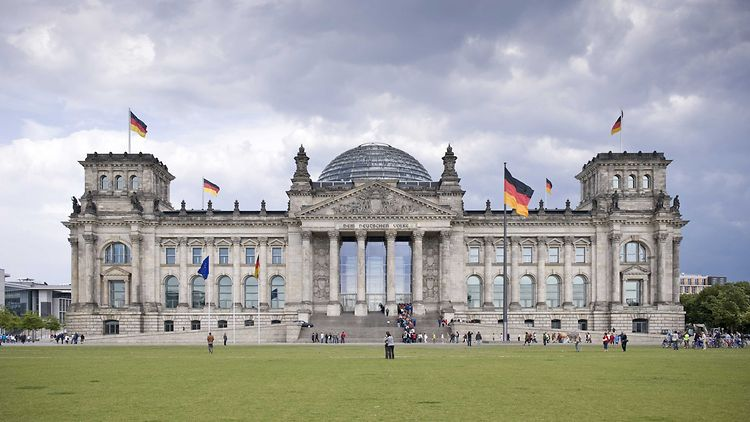
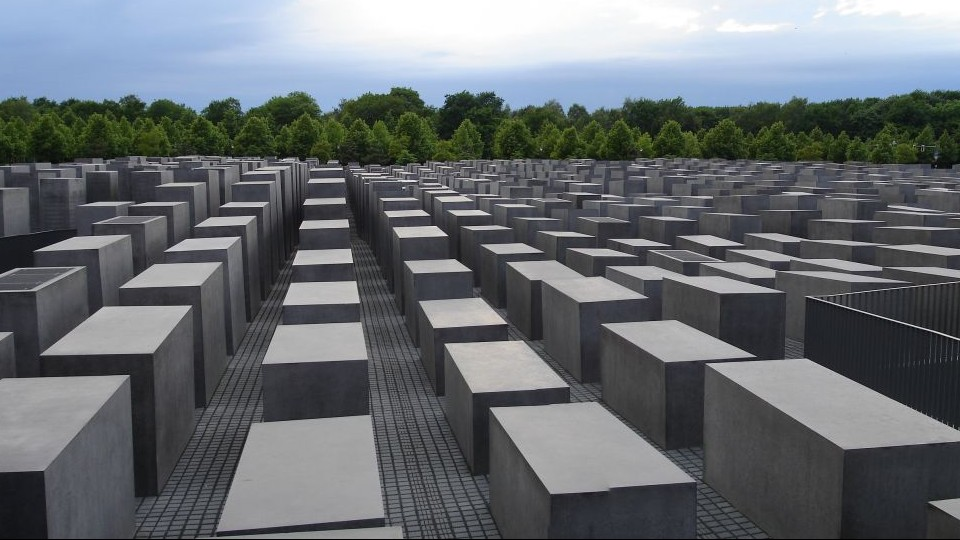
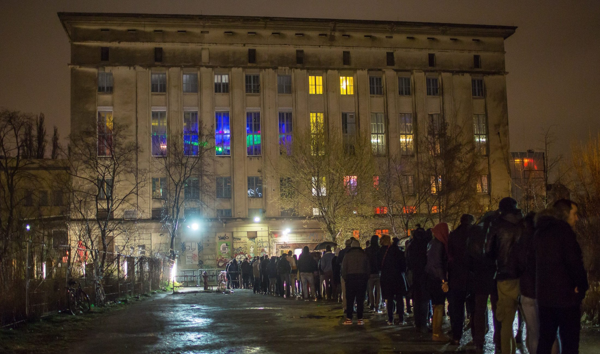
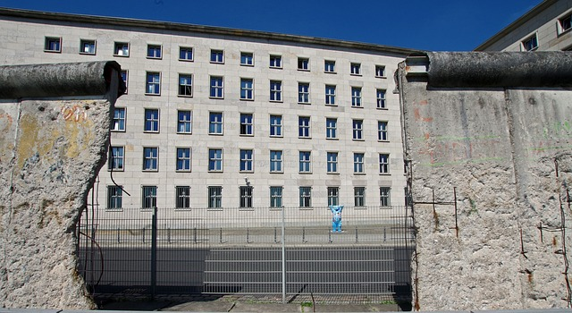

# Berlin zeigt mir dein Gesicht

    They say it since even Adam and Moses,
    billions of us who now live and breathe,
    that Man proposes and God disposes,
    Useless are your cravings, useless your greed.

    Things unfamiliar seem to happen to me of late,
    I landed in Berlin with a turn of Fate.

    A city which has seen world both new and old,
    which knows how low humanity can fall, 
    a city full of strangest taste and culture,
    I found Berlin weirdest of all.

    Like a student I studied Berlin,
    like a disciple I believed in its glories,
    like a devout I followed its voice,
    like a child I reveled in its stories.

    Having lived in its panorama of culture and race,
    I asked, "Berlin is this your true face?"

    Berlin ist das dein wahres Gesicht ?

    The spirit of Berlin unsure of wrongs or rights,
    unsure of what secrets to show or hide,
    unsure to reveal humanity's falls or heights,
    started flying, clamped me to her side.

## Part 1 - Reichstag building

	We flew over a building with its roof made of glasses,
    Inside were politicians dressed in suits and boots.
	a government which decided fates of refugees and masses,
	a government which knows your lineage and roots.
	
    I saw, I heard and tried to comprehend,
    I tore down thier discussions to its very base,
    then I turned to the spirit, to this friend, 
    I asked, "Berlin is this your true face?"

    Berlin ist das dein wahres Gesicht ?
    The sprit of Berlin unsure of wrongs or rights,
    unsure of what secrets to show or hide,
    unsure to reveal humanity's falls or heights,
    clutched my hands, clamped me to her side.
    I saw a smile that was not plain, nor sly
	She flew me again without any reply.

## Part 2 - The Holocaust Memorial

    We reached a square overseeing gargentuan gate,
    surrounded by green grass and fences,
	I surveryed and loitered around,
	then stumbled on low-high cemented grey benches.

	As I walked through those narrow lanes,
    admist memories of humanity's greatest crimes,
    judging history of its losses and gains
    imagining life in those horrendous times.

    I still seem to hear screams and voices,
    those graves seems to hide a secret,
    showing man at its lowest admist noises,
	they spoke how ends the path of hatred.

    I could not control my feelings, my hearts pace.
	Again I turned to the spirit, to this friend, 
    I shouted with anger, "Berlin is this your true face?"

	Berlin ist das dein wahres Gesicht ?
    The sprit of Berlin unsure of wrongs or rights,
    unsure of what secrets to show or hide,
    unsure to reveal humanity's falls or heights,
    clutched my hands, clamped me to her side.
    I saw a smile that was not plain, nor sly
	She flew me again without any reply.

## Part 3 - Berghain

	We landed in front of lines of tourists,
	admist doors full of grafities and paints,
    I could hear beats that reached not just ears,
    music so powerful that one just faints.

	Its dark corners blinding the very soul,
    bodies dancing not to enjoy but to heel,
	My eyes witnessed Beauty and frenzy interleaned together, 
	My mind couldn't comprehend, my heart couldn't feel.

	Within smell of smoke and hash, my eyes could gaze,
	Again I turned to the spirit, to this friend, 
    I shouted with frenzy, "Berlin is this your true face?"

	Berlin ist das dein wahres Gesicht ?
    The sprit of Berlin unsure of wrongs or rights,
    unsure of what secrets to show or hide,
    unsure to reveal humanity's falls or heights,
    clutched my hands, clamped me to her side.
    I saw a smile that was not plain, nor sly
	She flew me again without any reply.

## Part 4 - Berlin Wall
	

	I landed in front of in green stetch of land 
	what laid in front was just a stretch of Wall,
	within those bricks under mortar and cement, felt my hand
    cries which through corridors of history call.
	
    I saw a city fighting from its past, 
    trying from its guilts to break free,
    its seemed to tell me its story,
    and I kept gazing like the river Spree.
	
	Again I turned to the spirit, to this friend, 
    She smiled and said our journey has come to its end.
    This is the dream I will remember for rest of my days,
	When it was revealed to me, Berlin's true face.
	
